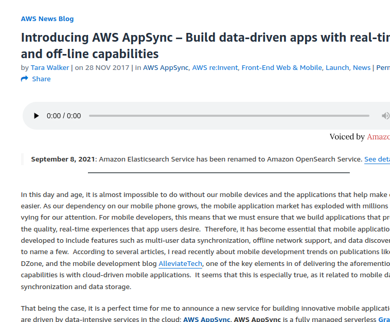
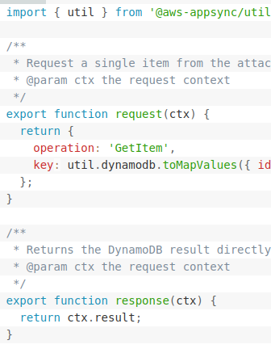
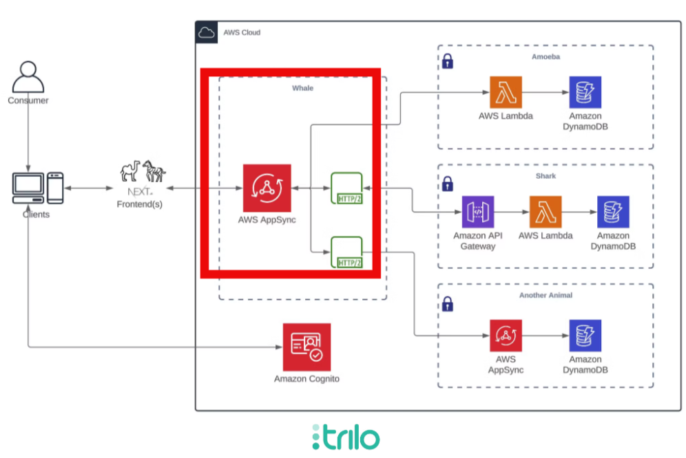

<!-- Global style -->

<!-- backgroundImage: "linear-gradient(to bottom, #ffffff, #EBEFFC)" -->
<!-- _class: lead -->

# Why You Should Build Your Next Product With AppSync
### Marco Troisi

---
<!-- footer: Marco Troisi • Why You Should Build Your Next Product With AppSync -->
<!-- paginate: true -->
<!-- backgroundImage: none -->

## Hello there!

- Marco Troisi
- Born in 🇮🇹 Living in 🇬🇧
- CTO at Trilo
- Software Developer and Software Architect for over 12 years
- AWS Community Builder (Serverless)
- Writer for The Serverless Mindset newsletter

---

## Agenda

- The evolution of AppSync
- *Reason #1*: Rapid Prototyping
- *Reason #2*: Infinite Scalability
- *Reason #3*: Team Collaboration
- *Reason #4*: Native AWS Integration
- *Reason #5*: Error Reduction
- *Reason #6*: Cloud-Native Evolution
- *Reason #7*: Empowering Small Teams

---

## The evolution of AppSync

- The old AppSync 
  - VT-*hell*
  - Not so great DX
  - Business logic very hard to test

---

## The evolution of AppSync

- The *new* AppSync 
  - Javascript resolvers
  - Lambda resolvers
  - Direct connections

---

# Rapid Prototyping

1. Build a UI
2. Write the interactions in GraphQL
3. Figure out the AWS services needed
4. Write the resolvers
5. Amplify codegen
6. Good to go 🎉

---

# Infinite Scalability

- Automatic scaling
- 100% serverless
- Real-time data sync
- IAM authentication
- Multi-region support

---

# Team Collaboration

- GraphQL as a shared language between frontend and backend
- Reduce misunderstandings
- Parallelise work

---

# Native AWS Integrations

- Easy to connect *directly* to AWS services
- No need for glue code

---

# Error Reduction

- Less reliance on custom code
- Fewer potential points of failure
- Less boilerplate

---

# Cloud-Native Evolution

- The convenience of Django, Rails, Laravel
- ...but backed by the cloud!

(AppSync is not a battery-included framework)

---

# Empowering Small Teams

- We rebuilt our entire API layer in a few weeks
- Made us much more productive and able to parallelise our work
- Has given us clarity over our data access patterns
- Has made it easier for frontend people to venture into the backend

---

<!-- 
paginate: false 
footer: ""
-->

---

# Thank You! 🙏

---

<!-- paginate: false -->

## Useful Links

